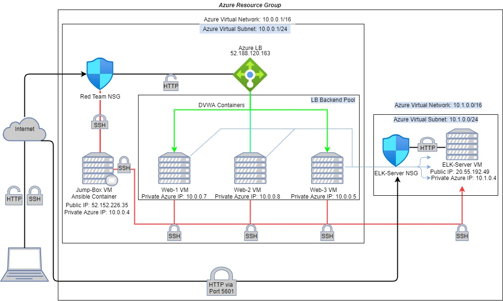

# Project 1

In this project, I set up a cloud monitoring system by configuring an ELK stack server.

## Automated ELK Stack Deployment

The files in this repository were used to configure the network presented below.



These files have been tested and used to generate a live ELK deployment on Azure. They can be used to recreate the entire deployment pictured above. Alternatively, select portions of the playbook files may be used to install certain pieces of it, such as Filebeat.

```yml
---
- name: Installing and launching filebeat
  hosts: elk
  become: yes
  tasks:

    # Use command module
  - name: Download filebeat deb
    command: curl -L -O https://artifacts.elastic.co/downloads/beats/filebeat/filebeat-7.6.1-amd64.deb

    # Use command module
  - name: Install filebeat deb
    command: dpkg -i filebeat-7.6.1-amd64.deb

    # Use copy module
  - name: Drop in filebeat.yml
    copy:
      src: /etc/ansible/files/filebeat-config.yml
      dest: /etc/filebeat/filebeat.yml
 
    # Use command module
  - name: Enable and configure system module
    command: filebeat modules enable logstash

    # Use command module
  - name: Setup filebeat
    command: filebeat setup

    # Use command module
  - name: Start filebeat service
    command: sudo service filebeat start
```

This document contains the following details:
- Description of the Topology
- Access Policies
- ELK Configuration
  - Beats in Use
  - Machines Being Monitored
- How to Use the Ansible Build

### Description of the Topology

The main purpose of this network is to expose a load-balanced and monitored instance of DVWA, the Damn Vulnerable Web Application.

Load balancing ensures that the application will be highly available, in addition to restricting traffic to the network.
- What aspect of security do load balancers protect?

   ***A load balancer protects against Distributed Denial-of-Service (DDoS) attacks.***

- What is the advantage of a jump box?

  ***A Jump Box controls access to other machines by allowing connections from specific IP addresses, then forwarding those connections to their respective machines.***

Integrating an ELK server allows users to easily monitor the vulnerable VMs for changes to the logs and system traffic.
- What does Filebeat watch for? ***Filebeat watches and collects data about the file system.***
- What does Metricbeat record? ***Metricbeat records and collects metrics of the system itself***.

The configuration details of each machine may be found below. 
```
| Name                 | Function     | IP Address     | Operating System |
|----------------------|--------------|----------------|------------------|
| Jump-Box-Provisioner | Gateway      | 52.152.226.35  | Linux            |
| Web-1                | UbuntuServer | 10.0.0.7       | Linux            |
| Web-2                | UbuntuServer | 10.0.0.8       | Linux            |
| Web-3                | UbuntuServer | 10.0.0.5       | Linux            |  
| Elk-Server           | UbuntuServer | 10.1.0.4       | Linux            |
| RED_TEAM_LB          | Load Balancer| 52.188.120.163 | Azure            |
```

### Access Policies

The machines on the internal network are not exposed to the public internet. Only the Jump-Box-Provisioner machine can accept connections from the internet.

Access to this machine is only allowed from the following IP address:
- 71.162.152.89

Machines within the network can only be accessed by SSH.
- Which machine did you allow to access your ELK VM? ***Jump-Box-Provisioner.*** 
- What is the machines IP address? ***52.152.226.35***

A summary of the access policies in place can be found in the table below:

```
| Name                 | Publicly Accessible | Allowed IP Addresses |
|----------------------|---------------------|----------------------|
| Jump-Box-Provisioner | Yes                 | 71.162.152.89        |
| Web-1                | No                  | 10.0.0.4             |
| Web-2                | No                  | 10.0.0.4             |
| Web-3                | No                  | 10.0.0.4             |
| Elk-Server           | No                  | 10.0.0.4             |
```

### Elk Configuration

Ansible was used to automate configuration of the ELK machine. No configuration was performed manually.
- What is the main advantage of automating configuration with Ansible?

  ***Automating with Ansible allows you create consistent, reproducible results throughout multiple machine configurations.***

The playbook implements the following tasks:
- Explain the steps of the ELK installation play.
   - Install docker.io
   - Install python3.pip
   - Install docker module
   - Increase virtual memory
   - Use more memory
   - Download and launch a docker elk container through published ports:
      - 5601:5601
      - 9200:9200
      - 5044:5044

The following screenshot displays the result of running `docker ps` after successfully configuring the ELK instance.


### Target Machines & Beats
This ELK server is configured to monitor the following machines:
- Web-1: 10.0.0.7
- Web-2: 10.0.0.8 
- Web-3: 10.0.0.5

I have installed the following Beats on these machines:
- Filebeat

These Beats allow us to collect the following information from each machine:
- In 1-2 sentences, explain what kind of data each beat collects, and provide 1 example of what you expect to see.

   - *Filebeat: **Filebeat monitors the log files or locations that you specify, such as Syslogs, as visualized by Kibana below.***

      ******

      

### Using the Playbook
In order to use the playbook, you will need to have an Ansible control node already configured. Assuming you have such a control node provisioned: 

SSH into the control node and follow the steps below:
- Copy the .yml file to the ansible directory.
- Update the /etc/ansible/ansible.cfg file to allow remote users. 
- Update the /etc/ansible/hosts file to allow the specific servers IP addresses and their published ports.  
- Run the playbook, and navigate to the Kibana website to check that the installation worked as expected.

Answer the following questions:
- Which file is the playbook? 

  ***.yml file***.

- Where do you copy it? 

  ***/etc/ansible, /etc/ansible/files, and /etc/ansible/roles*** 

- Which files do you update to make Ansible run the playbook on a specific machine? 

  ***/etc/ansible/hosts and /etc/ansible/ansible.cfg.***

- How do I specify which machine to install the ELK server on versus which to install Filebeat on? 

  ***By editing the /etc/ansible/hosts file with the appropriate IP addresses.***

- Which URL do you navigate to in order to check that the ELK server is running?

   ***http://<local.host>/app/kibana#/home.***

As a Bonus, provide the specific commands the user will need to run to download the playbook, update the files, etc.
- nano /etc/ansible/ansible.cfg
- nano /etc/ansible/hosts
- ansible all -m ping
- nano <your-playbook.yml>
- ansible-playbook <your-playbook.yml>
- ssh ansible@<your_IP>
- curl <local.host>/setup.php
